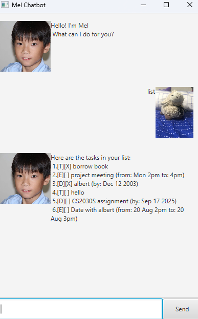

# Mel User Guide




Bored and want to have someone like Mel manage your tasks? :grin:
### Look no further for MEL is here

## Adding todos

You can add todo tasks into your task list!


Example: `todo drink milo`


```
 Got it. I've added this task:
  [T][ ] drink milo
 Now you have 6 task(s) in the list.
```

## Adding deadlines

You can add deadline tasks into your task list!


Example: `deadline CS2030S assignment /by 2025-09-17`

```
 Got it. I've added this task:
  [D][ ] CS2030S assignment (by: Sep 17 2025)
 Now you have 6 task(s) in the list.
```


## Adding events

You can add deadline tasks into your task list!


Example: `event Date with albert /from 20 Aug 2pm /to 20 Aug 3pm`

```
 Got it. I've added this task:
  [E][ ] Date with albert (from: 20 Aug 2pm to: 20 Aug 3pm)
 Now you have 7 task(s) in the list.
```


## Listing all tasks

You can list down all tasks to see all your tasks!

Example: `list`

```
 Here are the tasks in your list:
 1.[T][X] borrow book
 2.[E][ ] project meeting (from: Mon 2pm to: 4pm)
 3.[T][ ] albert
 4.[D][ ] albert (by: Dec 12 2003)
 5.[T][ ] hello
 6.[D][ ] CS2030S assignment (by: Sep 17 2025)
 7.[E][ ] Date with albert (from: 20 Aug 2pm to: 20 Aug 3pm)

```

## Deleting task

You can delete tasks that you no longer want to see!

Example: 'delete 3'

```
 OK, I've removed this task:
  [T][ ] albert
Now you have 6 tasks in the list.
```


## Mark and unmark task

You can mark and unmark tasks to show that you are done with it!

Example: `mark/unmark 1`

```
 Nice! I've marked this task as done:
  [D][X] albert (by: Dec 12 2003)
```

## Update tasks

You can update tasks even without having to delete and adding it again!

Example: `update 3 description eugene`

```
 Task updated successfully: [D][X] eugene (by: Dec 12 2003)
```

## Find tasks

You can find matching tasks in your list!

Example: `find albert`

```
 Here are the matching tasks in your list:
 1.[E][ ] Date with albert (from: 20 Aug 2pm to: 20 Aug 3pm)
```

## Close the command

Close the application by simply typing 'bye' to Mel!

Example: `bye`

```
  Bye! Hope to see you again soon!
```